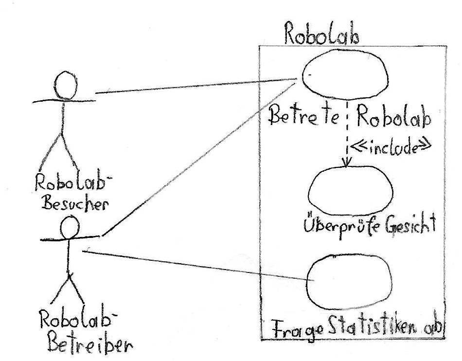

# Pflichtenheft

## Rahmenbedingungen:
* Projektleiter: Erik Mayrhofer
* Projektmitarbeiter: Erik Mayrhofer, Florian Schwarcz
* Ausstattung: Raspberry Pi, PI-Infrarotkamera, RPI Weitwinkel-CAM, Logitech 270 Webcam

## Motivation

Diese Projekt wird im Rahmen des SYP-Unterrichts durchgeführt und wurde von unserem Professor, Herrn Stütz, in Auftrag gegeben. Wir sollen uns mit Objekt- bzw. Gesichtserkennung auseinandersetzen und somit das Robolab der HTL-Leonding ein Stück sicherer machen.

## Ausgangslage und Ist-Zustand

### Problembereich

Was ist das Robolab?
Plan des Robolabs?
Unsicher?

Das Robolab der HTL Leonding ist derzeit zu wenig gesichert, wenn Schäden angerichtet werden, kann der Verursacher nicht genau bestimmt werden. Jeder mit Zutrittserlaubnis kann den Raum betreten, wer sich aber darin wann aufhält kann nicht bestimmt werden.

### Glossar

| Begriff | Erklärung
| - | -
| Robolab | Raum, der im Problembereich genau beschrieben wurde
| NAOs | Humanoide Roboter, mit denen unter anderem im Robolab gearbeitet wird
| Raspberry Pi | Minicomputer
| Eintrittsereignis | Betreten des Robolabs
| Winkelagnostizität | Fähigkeit, Gesichter zu erkennen, die nicht zwingend frontal aufgenommen wurden
| Erkennungssicherheit | Wert zur Bestimmung, wie sehr ein erkanntes Gesicht mit einem der Vergleichsbildern übereinstimmt
| Erkennungsgenauigkeit | Erfolgschance, ein Gesicht richtig zuzuordnen

### Abläufe

## Zielsetzung

Die Sicherheit im Robolab soll durch Installation einer Kamera mit Gesichtserkennung erhöht werden. Mindestens 90% aller Gesichter sollten richtig erkannt und identifiziert werden, wodurch Daten über den Aufenthalt von Personen im Raum gesammelt werden können. Zu verwenden sind die in der Ausstattung enthaltenen Kameras sowie der Raspberry Pi.

Verwendet wird das System bzw. dessen generiertes Protokoll nur von den Betreibern des Robolabs, die die Aufenthaltsdaten brauchen.

## Sollzustand

Die Software auf dem Raspberry Pi soll Gesichter erkennen und sowohl Daten über die Person, als auch Zeitpunkt der Registrierung in eine Datei speichern. Die Gesichter sollen nicht zwingend frontal aufgenommen werden müssen, demnach muss Winkelagnostizität gegeben sein.

### Funktionale Anforderungen

ID: Anf01: Gesichter erkennen\
ID: Anf02: Gesichter zuordnen\
ID: Anf03: Protokoll erstellen\
ID: Anf04: Protokolle über Fileserver zugänglich machen

#### Use Case

### Nicht-Funktionale Anforderungen
Die Erkennungsgenauigkeit soll möglichst hoch sein, als Mindestzielwert wird 90% in Betracht gezogen.
Das System soll nicht überlastet werden, wenn es viele Personen gleichzeitig erkennt und zuordnen muss. Es muss nicht zwingend in Echtzeit die Gesichter erkennen können.
Auch bei ungünstigen Lichtverhältnissen soll die 90%-Quote eingehalten werden.
Nichterkennungen sollen auch mitprotokolliert werden.

## Mengengerüst
Stammdaten der Schüler

## Risikoakzeptanz ???

## Schnittstellenübersicht

## Abbildunsverzeichnis
