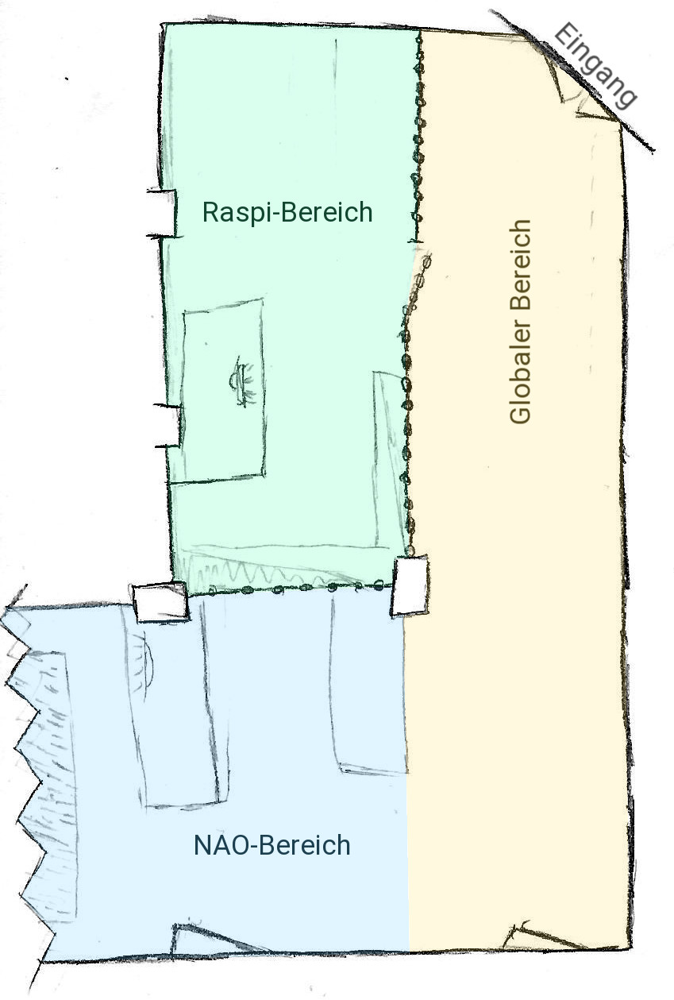
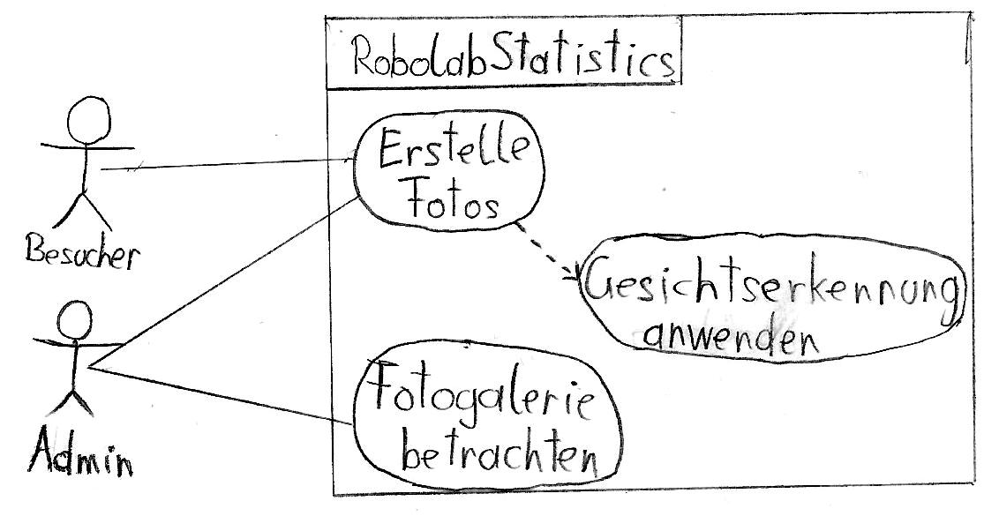
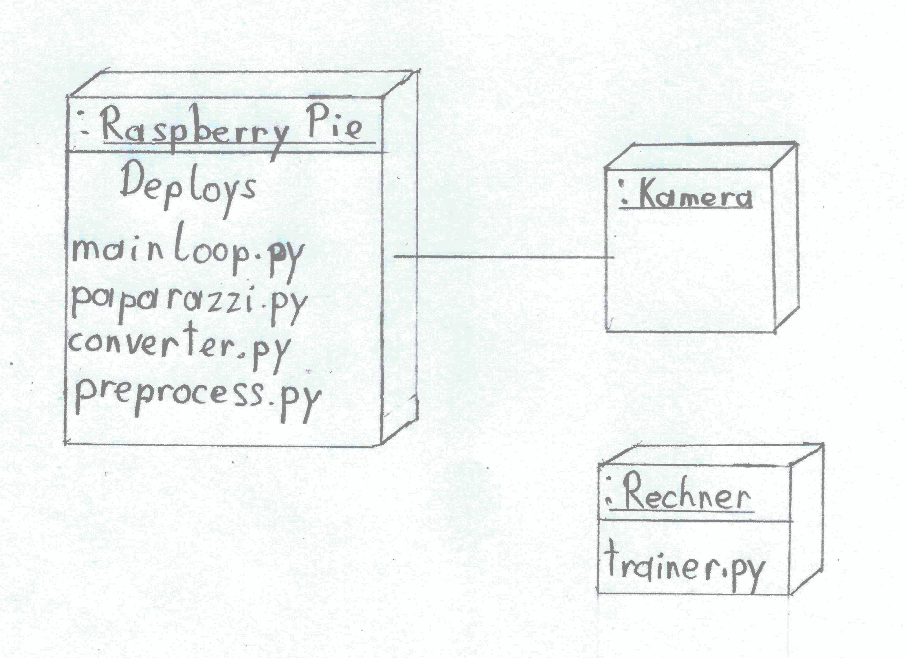

# Pflichtenheft

## Rahmenbedingungen
* Projektauftraggeber: Thomas Stütz
* Projektleiter: Erik Mayrhofer
* Projektmitarbeiter: Erik Mayrhofer, Florian Schwarcz
* Ausstattung: Raspberry Pi, PI-Infrarotkamera, RPI Weitwinkel-CAM, Logitech 270 Webcam

## Motivation

Dieses Projekt wird im Rahmen des SYP-Unterrichts durchgeführt und wurde von Herrn Professor Stütz in Auftrag gegeben. Das Projektteam soll sich mit Objekt- bzw. Gesichtserkennung auseinandersetzen und somit das Robolab der HTL-Leonding ein Stück sicherer machen.

## Inhaltsverzeichnis
* Ausgangslage und Ist-Zustand
    * Problembereich
    * Glossar
* Aufgabenstellung
* Zielsetzung
* Sollzustand
    * Funktionale Anforderungen
    * RobolabStatistics Use-Case-Diagramm
    * Nicht-Funktionale Anforderungen
* Mengengerüst
* Schnittstellenübersicht
* Lieferumfang
* Abnahmekriterien

## Ausgangslage und Ist-Zustand

### Problembereich

In der HTL-Leonding gibt es im Untergeschoss das Robolab. Darin arbeiten Schüler und Lehrer zum einen an den NAO's (Humanoide Roboter) und zum anderen an Raspberries und anderen ähnlichen Projekten.

\
Relevanter Bereich des Robolabs (nicht maßstabsgetreu)

Da die Tür des Robolabs nicht immer abgesperrt wird und sich zusätzlich fast jeder Schüler Zugriff verschaffen kann, ist die Sicherheit des Robolabs nicht gewährleistet. Wenn Schäden - ob willkürlich oder durch einen Unfall - auftreten, kann zur Zeit nicht nachgewiesen werden, wer dafür verantwortlich ist. Durch das Bewusstsein der Schüler über eine Überwachungskamera können Vandalenakte vermieden werden.

### Glossar

| Begriff | Erklärung
| - | -
| Robolab | Raum, der im Problembereich genau beschrieben wurde
| NAOs | Humanoide Roboter, mit denen unter anderem im Robolab gearbeitet wird
| Raspberry Pi | Minicomputer
| Eintrittsereignis | Betreten des Robolabs
| Winkelagnostizität | Fähigkeit, Gesichter zu erkennen, die nicht zwingend frontal aufgenommen wurden
| Erkennungssicherheit | Wert zur Bestimmung, wie sehr ein erkanntes Gesicht mit einem der Vergleichsbildern übereinstimmt
| Erkennungsgenauigkeit | Erfolgschance, ein Gesicht richtig zuzuordnen

## Aufgabenstellung
Die Aufgabe des Projektteams ist es, sich mit Gesichtserkennung zu beschäftigen und vorhandene Frameworks zu nutzen, um ein Programm zu entwickeln, das auf einem Raspberry Pi mit entsprechenden Kameras lauffähig ist. In diesem Programm sind zum einen die Gesichtserkennung zu implementieren, zum anderen die Möglichkeit, daraus Statistiken über den Aufenthalt von Personen im Raum zu generieren und diese den Robolab-Admins zur Verfügung zu stellen. Eine Galerie der geschossenen und verwendeten Fotos soll auch einsehbar sein.\
Damit die Erkennung möglichst oft und in möglichst kurzer Zeit gelingt, müssen wir uns entscheiden, wie genau das Verhältnis Genauigkeit zu Zeit aussehen soll.

## Zielsetzung

Die Sicherheit im Robolab soll durch Installation einer Kamera mit Gesichtserkennung erhöht werden. Es sollen Daten über den Aufenthalt von Personen im Raum gesammelt werden. Zu verwenden sind die in der Ausstattung enthaltenen Kameras sowie der Raspberry Pi.

Verwendet wird das System bzw. dessen generiertes Protokoll nur von den Admins des Robolabs, die die Aufenthaltsdaten brauchen.

## Sollzustand

Die Software auf dem Raspberry Pi erkennt Gesichter und speichert sowohl Daten über die Person, als auch Zeitpunkt des Eintrittsereignisses in eine Datei. Die Gesichter werden nicht zwingend frontal aufgenommen, demnach muss Winkelagnostizität gegeben sein.\
Neue Personen können dem System hinzugefügt werden, ohne die Software darauf trainieren zu müssen.ß

### Funktionale Anforderungen

ID: Req01: Gesichter erkennen\
ID: Req02: Gesichter zuordnen\
ID: Req03: Protokoll erstellen\
ID: Req04: Protokolle über Fileserver zugänglich machen\
ID: Req05: Neue Personen dem System hinzufügen

### RobolabStatistics Use-Case-Diagramm

\
Use-Case-Diagramm von RobolabStatistics

### Nicht-Funktionale Anforderungen
* Möglichst hohe Erkennungsgenauigkeit, mindestens 90%
* Auch bei ungünstigen Lichtverhältnissen mindestens 90%
* System darf nicht bei vielen Personen überlastet werden
* Keine zwingende Zuordnung in Echtzeit
* Mitprotokollierung von Nichterkennungen

## Mengengerüst
Folgende Stammdaten werden sich ergeben:

Jede Person, die Zutrittsauthorisierung hat, wird eingetragen mit:
* Name
* Klasse
* Gesichtsdaten

Zutrittsberechtigung wird vermutlich an etwa 100 Personen vergeben.

Für jedes Eintrittsereignis wird mitprotokolliert:
* Uhrzeit und Datum
* Vermutete Person
* Erkennungssicherheit

Es wird mit maximal 20 Eintrittsereignissen pro Tag gerechnet.

## Schnittstellenübersicht
Die Protokolle können über FTP direkt am Raspberry eingesehen werden. Der Raspberry nimmt die nötigen Bilder mit einer oder mehreren Kameras auf, eventuell sind die Kameras infrarot- oder weitwinkelfähig.

## Lieferumfang
* Software auf dem Git-Repository
* Installation auf einem Raspberry Pi mit entsprechenden Kameras
* Installation des Gerätes im Robolab

\
Deployment-Diagramm von RobolabStatistics

## Abnahmekriterien
Die Punkte, die in den funktionalen und nicht-funktionalen Anforderungen beschrieben wurden, müssen erreicht werden.