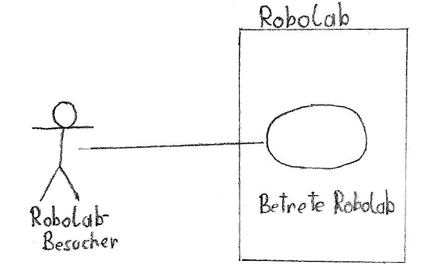

# Pflichtenheft

## Rahmenbedingungen:
* Projektleiter: Erik Mayrhofer
* Projektmitarbeiter: Erik Mayrhofer, Florian Schwarcz
* Ausstattung: Raspberry Pi, PI-Infrarotkamera, RPI Weitwinkel-CAM, Logitech 270 Webcam

## Motivation

Diese Projekt wird im Rahmen von SYP durcheführt und wurde von unserem Professor, Herrn Stütz, in Auftrag gegeben. Wir sollen uns mit Objekt- bzw. Gesichtserkennung auseinandersetzen und somit das Robolab der HTL-Leonding ein Stück sicherer machen.

## Ausgangslage und Ist-Zustand

### Problembereich

Was ist das Robolab?
Plan des Robolabs?
Unsicher?

Das Robolab der HTL Leonding ist derzeit zu wenig gesichert, wenn Schäden angerichtet werden, kann der Verursacher nicht genau bestimmt werden. Jeder mit Zutrittserlaubnis kann den Raum betreten, wer sich aber darin wann aufhält kann nicht bestimmt werden.

### Glossar

| Begriff | Erklärung |
| - | - |
| Robolab | Raum, der im Problembereich genau beschrieben wurde |
| NAOs | Humanoide Roboter, mit denen unter anderem im Robolab gearbeitet wird |
| Raspberry Pi | Minicomputer |
| Eintrittsereignis | Betreten des Robolabs |

### Abläufe

## Zielsetzung

Die Sicherheit im Robolab soll durch Installation einer Kamera mit Gesichtserkennung erhöht werden. Mindestens 90% aller Gesichter sollten richtig erkannt und identifiziert werden, wodurch Daten über den Aufenthalt von Personen im Raum gesammelt werden können. Zu verwenden sind die in der Ausstattung enthaltenen Kameras sowie der Raspberry Pi.
Das System soll auch dazu fähig sein, wenn es am Straßenrand installiert wird, vorbeifahrende Fahrzeuge zu erkennen und den Kategorien PKW und LKW zuzuordnen.

Verwendet wird das System im Gesichtserkennungs-Modus nur von den Betreibern des Robolabs, die die Aufenthaltsdaten brauchen.

## Sollzustand

Die Software auf dem Raspberry Pi soll Gesichter erkennen und sowohl Daten über die Person, als auch Zeitpunkt der Registrierung in eine Textdatei speichern. Die Gesichter sollen nicht zwingend frontal aufgenommen werden müssen, demnach muss Perspektivenunabhängigkeit gegeben sein.
Im Abschnitt der Fahrzeuge soll nur erkannt werden, ob das vorbeifahrende Fahrzeug ein PKW oder LKW ist. Andere Eigenschaften wie Modell, Farbe, Größe u. A. sollen *nicht* beachtet werden.

TODO AUFTEILEN

### Funktionale Anforderungen
Arbeitsaufteilung
#### Use Case

TODO Soll use case diagramm

##### Beschreibung der Use-Cases
### Nicht-Funktionale Anforderungen
Erkennungsgenauigkeit
Performance
Lichtverhältnisse
Fehlerbehandlung

## Mengengerüst
Stammdaten der Schüler

## Risikoakzeptanz ???

## Schnittstellenübersicht

## Abbildunsverzeichnis
