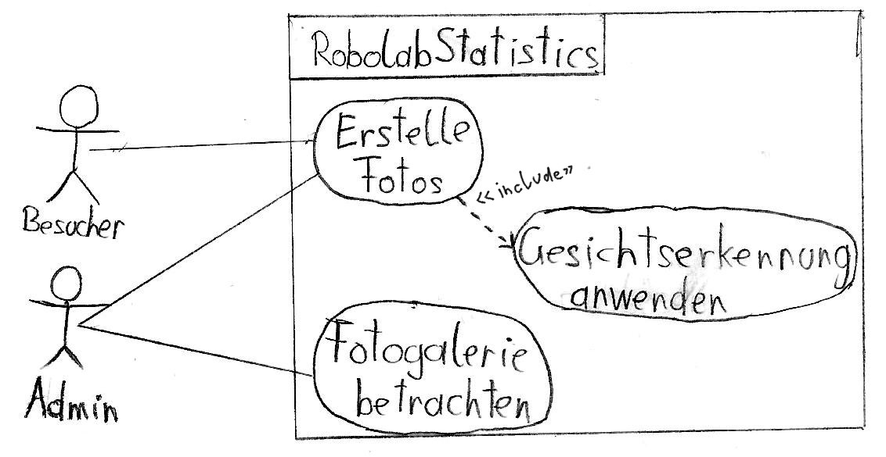

# Pflichtenheft

## Rahmenbedingungen
* Projektauftraggeber: Professor Thomas Stütz
* Projektleiter: Erik Mayrhofer
* Projektmitarbeiter: Erik Mayrhofer, Florian Schwarcz
* Ausstattung: Raspberry Pi, PI-Infrarotkamera, RPI Weitwinkel-CAM, Logitech 270 Webcam

## Motivation

Dieses Projekt wird im Rahmen des SYP-Unterrichts durchgeführt und wurde von Herrn Professor Stütz in Auftrag gegeben. Wir sollen uns mit Objekt- bzw. Gesichtserkennung auseinandersetzen und somit das Robolab der HTL-Leonding ein Stück sicherer machen.

## Inhaltsverzeichnis
* Ausgangslage und Ist-Zustand
    * Problembereich
    * Glossar
* Aufgabenstellung
* Zielsetzung
* Sollzustand
    * Funktionale Anforderungen
    * RobolabStatistics Use-Case-Diagramm
    * Nicht-Funktionale Anforderungen
* Mengengerüst
* Schnittstellenübersicht
* Lieferumfang
* Abnahmekriterien

## Ausgangslage und Ist-Zustand

### Problembereich

In der HTL-Leonding gibt es im Untergeschoss das Robolab. Darin arbeiten Schüler und Lehrer zum einen an den NAO's (Humanoide Roboter) und zum anderen - unter der Aufsicht von Professor Stütz - an Raspberries und anderen ähnlichen Projekten.

")

Da die Tür des Robolabs nicht immer abgesperrt wird und sich zusätzlich fast jeder Schüler Zugriff verschaffen kann, ist die Sicherheit des Robolabs nicht gewährleistet. Wenn Schäden - ob willkürlich oder durch einen Unfall - auftreten, kann zur Zeit nicht nachgewiesen werden, wer dafür verantwortlich ist.

### Glossar

| Begriff | Erklärung
| - | -
| Robolab | Raum, der im Problembereich genau beschrieben wurde
| NAOs | Humanoide Roboter, mit denen unter anderem im Robolab gearbeitet wird
| Raspberry Pi | Minicomputer
| Eintrittsereignis | Betreten des Robolabs
| Winkelagnostizität | Fähigkeit, Gesichter zu erkennen, die nicht zwingend frontal aufgenommen wurden
| Erkennungssicherheit | Wert zur Bestimmung, wie sehr ein erkanntes Gesicht mit einem der Vergleichsbildern übereinstimmt
| Erkennungsgenauigkeit | Erfolgschance, ein Gesicht richtig zuzuordnen

## Aufgabenstellung
Unsere Aufgabe als Projektteam ist es, uns mit Gesichtserkennung zu beschäftigen und ein Programm zu entwickeln, das auf einem Raspberry Pi mit entsprechenden Kameras lauffähig ist. In diesem Programm sind zum einen die Gesichtserkennung zu implementieren, zum anderen die Möglichkeit, daraus Statistiken über den Aufenthalt von Personen im Raum zu generieren und diese den Robolab-Admins zur Verfügung zu stellen. Eine Galerie der geschossenen und verwendeten Fotos soll auch einsehbar sein.
Damit die Erkennung möglichst oft und in möglichst kurzer Zeit gelingt, müssen wir uns entscheiden, wie genau das Verhältnis Genauigkeit zu Zeit aussehen soll.

## Zielsetzung

Die Sicherheit im Robolab soll durch Installation einer Kamera mit Gesichtserkennung erhöht werden. Es sollen Daten über den Aufenthalt von Personen im Raum gesammelt werden. Zu verwenden sind die in der Ausstattung enthaltenen Kameras sowie der Raspberry Pi.

Verwendet wird das System bzw. dessen generiertes Protokoll nur von den Admins des Robolabs, die die Aufenthaltsdaten brauchen.

## Sollzustand

Die Software auf dem Raspberry Pi erkennt Gesichter und speichert sowohl Daten über die Person, als auch Zeitpunkt des Eintrittsereignisses in eine Datei. Die Gesichter werden nicht zwingend frontal aufgenommen, demnach muss Winkelagnostizität gegeben sein.

### Funktionale Anforderungen

ID: Anf01: Gesichter erkennen\
ID: Anf02: Gesichter zuordnen\
ID: Anf03: Protokoll erstellen\
ID: Anf04: Protokolle über Fileserver zugänglich machen

### RobolabStatistics Use-Case-Diagramm

### Nicht-Funktionale Anforderungen
Die Erkennungsgenauigkeit soll möglichst hoch sein, als Mindestzielwert wird 90% in Betracht gezogen.
Das System darf nicht überlastet werden, wenn es viele Personen gleichzeitig erkennt und zuordnen muss. Es muss nicht zwingend in Echtzeit die Gesichter zuordnen können.
Auch bei ungünstigen Lichtverhältnissen soll die 90%-Quote eingehalten werden.
Nichterkennungen werden auch mitprotokolliert.

## Mengengerüst
Folgende Stammdaten werden sich ergeben:

Jede Person, die Zutrittsauthorisierung hat, wird eingetragen mit:
* Name
* Klasse
* Gesichtsdaten
Zutrittsberechtigung wird vermutlich an etwa 100 Personen vergeben.

Für jedes Eintrittsereignis wird mitprotokolliert:
* Uhrzeit und Datum
* Vermutete Person
* Erkennungssicherheit
Wir rechnen mit max. 20 Eintrittsereignissen pro Tag.

## Schnittstellenübersicht
Die Protokolle können über FTP direkt am Raspberry eingesehen werden. Der Raspberry nimmt die nötigen Bilder mit einer oder mehreren Kameras auf, eventuell sind die Kameras infrarot- oder weitwinkelfähig.

## Lieferumfang
Der Lieferumfang umfasst die Software auf dem Git-Repository und die Installation auf einem Raspberry Pi, an dem die Kameras, für die wir uns entscheiden, angeschlossen sind. Welche verwendet werden, wird im Laufe des Projekts bestimmt.

## Abnahmekriterien
Die Punkte, die in den funktionalen und nicht-funktionalen Anforderungen beschrieben wurden, müssen erreicht werden.